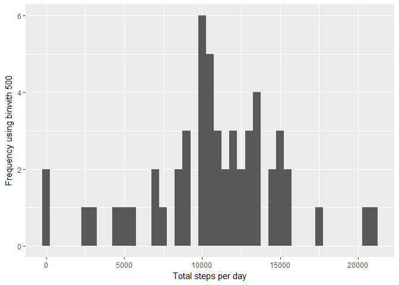
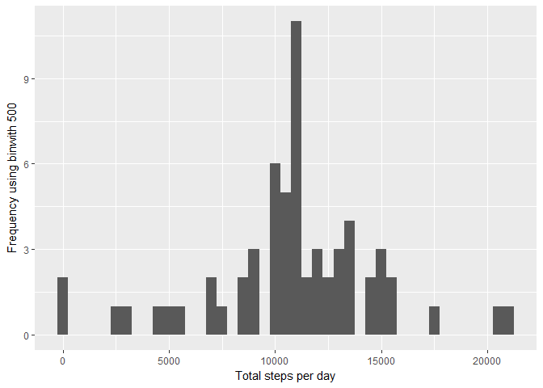
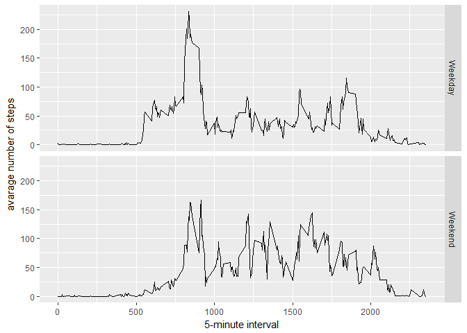

## Loading and preprocessing the data

1. Load The Data & Process the data

```r
setwd("D://DataScienceCourse//Course 5//Week 2//Week2 Project")
library(ggplot2)

acti_data <- read.csv("activity.csv")
summary(acti_data)
```

```
##      steps                date          interval     
##  Min.   :  0.00   2012-10-01:  288   Min.   :   0.0  
##  1st Qu.:  0.00   2012-10-02:  288   1st Qu.: 588.8  
##  Median :  0.00   2012-10-03:  288   Median :1177.5  
##  Mean   : 37.38   2012-10-04:  288   Mean   :1177.5  
##  3rd Qu.: 12.00   2012-10-05:  288   3rd Qu.:1766.2  
##  Max.   :806.00   2012-10-06:  288   Max.   :2355.0  
##  NA's   :2304     (Other)   :15840
```

2. Process the data

```r
head(acti_data)
```

```
##   steps       date interval
## 1    NA 2012-10-01        0
## 2    NA 2012-10-01        5
## 3    NA 2012-10-01       10
## 4    NA 2012-10-01       15
## 5    NA 2012-10-01       20
## 6    NA 2012-10-01       25
```

```r
acti_data_no_na <- na.omit(acti_data)
```


## What is mean total number of steps taken per day?
1. Calculate the total number of steps taken per day

```r
stepsByDay <- tapply(acti_data_no_na$steps, acti_data_no_na$date, sum,na.rm=TRUE)
head(stepsByDay)
```

```
## 2012-10-01 2012-10-02 2012-10-03 2012-10-04 2012-10-05 2012-10-06 
##         NA        126      11352      12116      13294      15420
```

2. Make a histogram of the total number of steps taken each day

```r
qplot(stepsByDay, xlab='Total steps per day', ylab='Frequency using binwith 500', binwidth=500)
```

```
## Warning: Removed 8 rows containing non-finite values (stat_bin).
```

<!-- -->

3.Calculate and report the mean and median of the total number of steps taken per day

- Mean

```r
stepsByDayMean <- mean(stepsByDay,na.rm=TRUE)
stepsByDayMean
```

```
## [1] 10766.19
```

- Median

```r
stepsByDayMedian <- median(stepsByDay,na.rm=TRUE)
stepsByDayMedian
```

```
## [1] 10765
```

## What is the average daily activity pattern?


```r
averageStepsPerTimeBlock <- aggregate(x=list(meanSteps=acti_data$steps), by=list(interval=acti_data$interval), FUN=mean, na.rm=TRUE)

head(averageStepsPerTimeBlock)
```

```
##   interval meanSteps
## 1        0 1.7169811
## 2        5 0.3396226
## 3       10 0.1320755
## 4       15 0.1509434
## 5       20 0.0754717
## 6       25 2.0943396
```


1.Make a time series plot (i.e. type = "l") of the 5-minute interval (x-axis) and the average number of steps taken, averaged across all days (y-axis)


```r
ggplot(data=averageStepsPerTimeBlock, aes(x=interval, y=meanSteps)) +
    geom_line() +
    xlab("5-minute interval") +
    ylab("average number of steps taken") 
```

<!-- -->

2.Which 5-minute interval, on average across all the days in the dataset, contains the maximum number of steps?


```r
 max.steps.interval <- averageStepsPerTimeBlock[which(averageStepsPerTimeBlock$meanSteps == max(averageStepsPerTimeBlock$meanSteps)),]

max.steps.interval
```

```
##     interval meanSteps
## 104      835  206.1698
```

## Imputing missing values

Note that there are a number of days/intervals where there are missing values (coded as NA). The presence of missing days may introduce bias into some calculations or summaries of the data.

1.Calculate and report the total number of missing values in the dataset (i.e. the total number of rows with NAs)


```r
numMissingValues <- length(which(is.na(acti_data$steps)))
numMissingValues
```

```
## [1] 2304
```


2.Devise a strategy for filling in all of the missing values in the dataset. The strategy does not need to be sophisticated. For example, you could use the mean/median for that day, or the mean for that 5-minute interval, etc.


```r
acti_impute <- merge(acti_data,averageStepsPerTimeBlock ,na.rm=TRUE)
head(acti_impute)
```

```
##   interval steps       date meanSteps
## 1        0    NA 2012-10-01  1.716981
## 2        0     0 2012-11-23  1.716981
## 3        0     0 2012-10-28  1.716981
## 4        0     0 2012-11-06  1.716981
## 5        0     0 2012-11-24  1.716981
## 6        0     0 2012-11-15  1.716981
```

3.Create a new dataset that is equal to the original dataset but with the missing data filled in.


```r
acti_impute$steps[is.na(acti_impute$steps)] <- acti_impute$meanSteps[is.na(acti_impute$steps)]
head(acti_impute)
```

```
##   interval    steps       date meanSteps
## 1        0 1.716981 2012-10-01  1.716981
## 2        0 0.000000 2012-11-23  1.716981
## 3        0 0.000000 2012-10-28  1.716981
## 4        0 0.000000 2012-11-06  1.716981
## 5        0 0.000000 2012-11-24  1.716981
## 6        0 0.000000 2012-11-15  1.716981
```


4.Make a histogram of the total number of steps taken each day and Calculate and report the mean and median total number of steps taken per day. Do these values differ from the estimates from the first part of the assignment? What is the impact of imputing missing data on the estimates of the total daily number of steps?


```r
stepsByDay2 <- tapply(acti_impute$steps, acti_impute$date, sum,na.rm=TRUE)
head(stepsByDay2)
```

```
## 2012-10-01 2012-10-02 2012-10-03 2012-10-04 2012-10-05 2012-10-06 
##   10766.19     126.00   11352.00   12116.00   13294.00   15420.00
```

```r
qplot(stepsByDay2, xlab='Total steps per day', ylab='Frequency using binwith 500', binwidth=500)
```

<!-- -->

```r
stepsByDayMean2 <- mean(stepsByDay2,na.rm=TRUE)
stepsByDayMean2
```

```
## [1] 10766.19
```

```r
stepsByDayMedian2 <- median(stepsByDay2,na.rm=TRUE)
stepsByDayMedian2
```

```
## [1] 10766.19
```


## Are there differences in activity patterns between weekdays and weekends?

For this part the weekdays() function may be of some help here. Use the dataset with the filled-in missing values for this part.

1.Create a new factor variable in the dataset with two levels - "weekday" and "weekend" indicating whether a given date is a weekday or weekend day.


```r
acti_impute$dateType <-  ifelse(weekdays(as.Date(acti_impute$date)) %in% c("Monday", "Tuesday", "Wednesday", "Thursday", "Friday"), "Weekday", "Weekend")
head(acti_impute)
```

```
##   interval    steps       date meanSteps dateType
## 1        0 1.716981 2012-10-01  1.716981  Weekday
## 2        0 0.000000 2012-11-23  1.716981  Weekday
## 3        0 0.000000 2012-10-28  1.716981  Weekend
## 4        0 0.000000 2012-11-06  1.716981  Weekday
## 5        0 0.000000 2012-11-24  1.716981  Weekend
## 6        0 0.000000 2012-11-15  1.716981  Weekday
```

```r
tail(acti_impute)
```

```
##       interval    steps       date meanSteps dateType
## 17563     2355 0.000000 2012-10-16  1.075472  Weekday
## 17564     2355 0.000000 2012-10-07  1.075472  Weekend
## 17565     2355 0.000000 2012-10-25  1.075472  Weekday
## 17566     2355 0.000000 2012-11-03  1.075472  Weekend
## 17567     2355 1.075472 2012-10-08  1.075472  Weekday
## 17568     2355 1.075472 2012-11-30  1.075472  Weekday
```


2.Make a panel plot containing a time series plot (i.e. type = "l") of the 5-minute interval (x-axis) and the average number of steps taken, averaged across all weekday days or weekend days (y-axis). See the README file in the GitHub repository to see an example of what this plot should look like using simulated data.


```r
averagedActivityDataImputed <- aggregate(steps ~ interval + dateType, data=acti_impute, mean)
ggplot(averagedActivityDataImputed, aes(interval, steps)) + 
    geom_line() + 
    facet_grid(dateType ~ .) +
    xlab("5-minute interval") + 
    ylab("avarage number of steps")
```

<!-- -->


